 

`AI AGENTS` · `LLMs` · `RAG` · `AI SECURITY` · `AUTONOMOUS SYSTEMS`

[GitHub](https://github.com/sivaguru-2113) · [LinkedIn](#) · [Email](mailto:sivaguruofficial2007@gmail.com)

> **BUILD WITH INTELLIGENCE**

---
<!-- ========================= FOCUS ========================= -->

### Focus

`AI Agents` · `LLMs` · `RAG` · `AI Security` · `Systems Architecture` · `Cloud`

<!-- ========================= ABOUT ME ========================= -->

<table width="100%" border="1" cellpadding="0" cellspacing="0">
<tr>
<td colspan="2" style="padding: 22px 26px 14px;">

# ABOUT ME

`IDEAS`　→　`SYSTEMS`　→　`IMPACT`

</td>
</tr>

<tr>
<td width="58%" valign="top" style="padding: 10px 26px 24px;">

I'm **SIVAGURU P**, an **AI Engineer** and **AI Architect**.

I build **intelligent systems** that solve real-world problems. My work focuses on **AI Agents**, **LLMs**, **RAG**, **AI Security**, and **Autonomous Systems** — combining research, engineering, and product thinking to create meaningful impact.

I'm constantly exploring new ideas, learning, and building projects that push what's possible with **AI and technology**.

Beyond technology, I'm inspired by **One Piece** and the idea of **JOYBOY** — freedom, curiosity, adventure, and a better world for everyone.

 

> *"The dream isn't just to be the best,* 
> *but to build a world where everyone can dream."* 
> — **JOYBOY**

</td>

<td width="42%" align="center" valign="middle" style="padding: 10px 22px 24px;">

</td>
</tr>
</table>

---

<!-- ========================= TECH STACK ========================= -->

### Tech stack

 

  

  

---

<!-- ========================= GITHUB ANALYTICS ========================= -->

### GitHub analytics

 

  

<table width="700">
<tr>
<td width="50%" align="center" valign="middle">

</td>
<td width="50%" align="center" valign="middle">

</td>
</tr>
<tr>
<td width="50%" align="center" valign="middle">

</td>
<td width="50%" align="center" valign="middle">

</td>
</tr>
</table>

---

<!-- ========================= CONTRIBUTIONS ========================= -->

### Contributions · Play while I code

 

---

<!-- ========================= PUBLIC REPOSITORIES ========================= -->

### Public repositories

<table width="850">
<tr>
<td width="50%" valign="top">

**[CODE-SENSEI](https://github.com/sivaguru-2113/CODE-SENSEI) ↗**

AI-powered coding assistant focused on intelligent code understanding and generation.

`Python` · `AI` · `Developer Tools`

</td>
<td width="50%" valign="top">

**[Agent-persona](https://github.com/sivaguru-2113/Agent-persona) ↗**

A persona wrapper for AI agents that enables adaptive, human-like interactions.

`Python` · `Agents` · `LLMs`

</td>
</tr>
</table>

